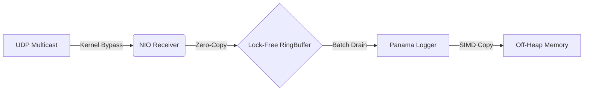

# Ultra-Low Latency HFT Trading Engine (Java 21)

-orange.svg)


A proof-of-concept **High-Frequency Trading (HFT) Data Ingestion Engine** written in pure Java. 
It simulates the full lifecycle of market data processing: from **UDP Multicast packet capture** to **Off-Heap persistence**, maintaining a **Zero-Garbage Collection** profile on the critical path.

## 🚀 Key Performance Metrics

Benchmarks executed on local workstation (Ryzen 5 / Intel i7 class) using JMH.

| Metric | Result | Description |
| :--- | :--- | :--- |
| **Ingestion Throughput** | **~16,360,000 msg/sec** | UDP Payload -> RingBuffer -> Disk |
| **GC Allocation Rate** | **0 bytes/op** | Validated via JMH `-prof gc` |
| **End-to-End Latency** | **< 600 ns** | Network Stack + Application logic |

## 🧠 System Architecture

The system is designed as a pipeline of lock-free components utilizing **Mechanical Sympathy**:



### 1. Network Layer (NIO Selector-Free)
* **Connected UDP:** Uses `DatagramChannel.connect()` to enable `read()` instead of `receive()`, avoiding the allocation of `InetSocketAddress` objects for every packet (Zero-Allocation Network Stack).
* **Busy Spin:** Replaces the blocking `Selector.select()` pattern with a CPU-pinned busy loop (`while(true)`) to eliminate context switch latency (Jitter).

### 2. The Lock-Free Ring Buffer (Disruptor Pattern)
Instead of blocking queues, we use a pre-allocated circular array.
* **Wait-Free Write:** Multi-Producer Single-Consumer (MPSC) design using `AtomicLong` CAS operations.
* **False Sharing Prevention:** Explicit padding on sequence counters ensures they reside on different **64-byte Cache Lines**, preventing core-to-core cache thrashing.
* **Bitwise Indexing:** Capacity is locked to Powers-of-2 to use bitwise AND (`&`) masking instead of expensive Modulo (`%`) instructions.

### 3. Off-Heap Persistence (Project Panama)
* **FFM API:** Uses Java 21's `MemorySegment` to write logs directly to native memory, bypassing the Java Heap entirely.
* **Vectorization:** Leveraging the JIT compiler to auto-vectorize byte copies into AVX instructions.

### 4. The "Drain" Pattern (Batching)
The Consumer thread does not acknowledge every single message (which would require expensive volatile writes). Instead, it **drains** all available messages in a tight loop and updates the `tail` sequence only once per batch, amortizing synchronization costs.

## ⚠️ Production Tuning Notes

This is a portfolio implementation. For a production deployment on Linux, the following OS-level optimizations are recommended:

* **CPU Affinity (Pinning):** Use `taskset` or `isolcpus` combined with libraries like **Java-Thread-Affinity** (OpenHFT) to lock the Receiver and Logger threads to isolated physical cores. This prevents L1/L2 cache pollution from OS scheduling.
* **Kernel Bypass:** Replace Java NIO with **Solarflare EF_VI** or **JNI/JNA** direct driver access to bypass the Linux Kernel network stack entirely (User-space networking).

## 💻 Usage

```java
// 1. Initialize Engine
PanamaLogger logger = new PanamaLogger();
RingBuffer buffer = new RingBuffer(16384);

// 2. Start Network Receiver (Busy Spin Mode)
// Captures UDP packets without creating objects
NioReceiver receiver = new NioReceiver(buffer);
new Thread(receiver).start();

// 3. Start Logger Consumer (Batch Drain Mode)
// Drains the buffer to Off-Heap memory
new Thread(() -> {
    while (running) {
        if (buffer.drain(logger) == 0) {
            Thread.onSpinWait(); // Efficient idle strategy
        }
    }
}).start();
```

## 🛠️ Build & Run
This project requires Java 21+.

```bash
# 1. Build the project
mvn clean package

# 2. Run Throughput & Zero-GC Proof (IngestionBenchmark)
# Validates the 18M ops/sec claim and 0 bytes allocation rate
java --enable-preview -jar target/benchmarks.jar IngestionBenchmark -prof gc

# 3. Run Component Latency Comparison (LoggerBenchmark)
# Compares Standard IO vs Heap Buffered IO vs Panama Off-Heap
java --enable-preview -jar target/benchmarks.jar LoggerBenchmark -prof gc
```

## 📜 License
MIT License.
MIT License.